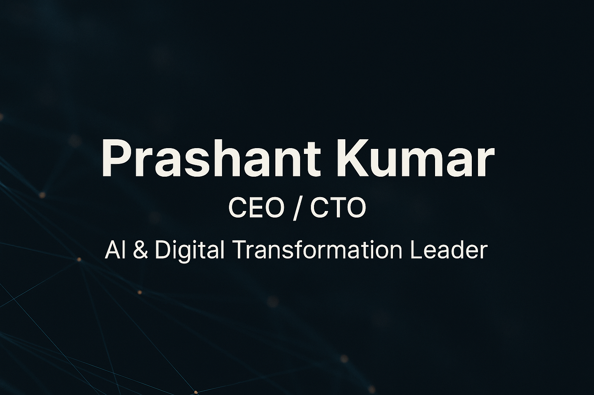

  

# Prashant Kumar
## Technology Executive | CEO/CTO | AI & Digital Transformation Leader | 20+ Years Experience

**Contact Information:**

**Leading enterprise-scale digital transformation and AI-first platform modernization across global markets**

---

## Quick Navigation

| Section | Description |
|---------|-------------|
| [Executive Overview](#executive-overview) | Leadership background, strategic experience, and core expertise |
| [Technology Stack](#technology-stack) | Complete technical capabilities and platform expertise |
| [Strategic Achievements](#strategic-achievements) | Key business outcomes and organizational impact |
| [Leadership Portfolio](#leadership-portfolio) | Executive roles and transformation initiatives |
| [Technology Analytics](#technology-portfolio--analytics) | Platform expertise and domain leadership |
| [Executive Differentiators](#executive-differentiators) | Strategic leadership capabilities |
| [Strategic Value](#strategic-value) | Executive value proposition |
| [Let's Connect](#lets-connect) | Contact and engagement |

---

## Executive Overview

With over two decades of executive technology leadership, I specialize in driving enterprise-scale SaaS transformation, global delivery excellence, and AI-first platform modernization. My track record spans C-suite roles in international technology organizations, delivering measurable business outcomes through strategic technology investments, organizational scaling, and data-driven product leadership.

### Core Leadership Expertise
- **Executive Technology Strategy**: Architecting long-term technology roadmaps aligned with P&L growth and investor expectations
- **AI & ML Leadership**: Directing enterprise AI adoption, LLM integration, and ML-driven product innovation
- **Global Delivery Excellence**: Building and scaling distributed engineering organizations across India, Europe, and MEA
- **Digital Transformation**: Leading platform modernization, cloud migration, and enterprise architecture evolution
- **E-Commerce & Digital Commerce**: Leading payment systems, transaction processing, marketplace platforms, and digital commerce strategy
- **Commercial Technology**: Partnering with sales and pre-sales teams on enterprise deals and solution engineering
- **Organizational Development**: Building cross-functional teams, mentoring leaders, and establishing innovation cultures

<a href="#top">Back to Top</a>

---

## Technology Stack

### **Executive Leadership Competencies**

### **Certifications & Credentials**

#### **Technology & AI Leadership**

#### **Project & Agile Leadership**

#### **Marketing & Analytics**

#### **Enterprise Platforms**

### **Strategic Technology Domains**

#### **AI & Machine Learning Leadership**

#### **Cloud & Platform Modernization**

#### **API Ecosystems & Integration**

#### **Platform Technologies**

#### **Data & Infrastructure**

<a href="#top">Back to Top</a>

---

## Strategic Achievements

| Metric | Achievement | Business Impact |
|--------|-------------|-----------------|
| **Executive Experience** | 20+ Years | C-suite technology leadership |
| **Global Team Scaling** | 45+ Engineers | Built GCC across engineering, QA, DevOps, analytics |
| **ML Accuracy** | 93%+ Hotel Mapping | AI-driven supplier integration across 50+ providers |
| **API Ecosystem** | 350+ Suppliers | Standardized connectivity frameworks reducing onboarding time |
| **SEO Infrastructure** | 120+ Microsites | Localized deployments driving organic growth |
| **Customer Experience** | 40% Escalation Reduction | Telemetry-driven decision-making improving NPS |
| **Engineering Throughput** | 30% Improvement | Agile transformation across 8 delivery pods |
| **Platform Reliability** | Zero-Downtime Deployments | Blue-green deployment systems enabling continuous delivery |
| **Commercial Impact** | SaaS Margin Optimization | Automation and cloud optimization strengthening gross margins |
| **Geographic Reach** | India/EU/MEA Operations | Cross-regional delivery leadership and coordination |
| **Enterprise Architecture** | Cloud-Native Transformation | Distributed systems modernization supporting global scale |
| **Strategic Transactions** | TUI Group Acquisition | Technical due diligence and integration leadership |

<a href="#top">Back to Top</a>

---

## Leadership Portfolio

### Executive Technology Leadership

| Role | Organization | Key Achievements | Business Impact |
|------|--------------|------------------|-----------------|
| **CEO (India)** | DCS Plus *Top 5 global travel technology company* | • Led India operations overseeing technology engineering and commercial growth • Directed AI-first transformation of core travel systems • Strengthened SaaS platform margins through automation and cloud optimization • Built and scaled GCC to 45+ engineers across engineering, QA, DevOps, analytics • Enhanced customer onboarding through standardized API integration flows | • Improved platform margins and operational efficiency • Established cross-functional alignment across product, engineering, sales, operations • Created innovation-centric engineering culture with growth paths and mentorship |
| **CTO** | Isango (Hotelbeds Group) | • Architected modernization of global travel platform • Delivered 120+ localized microsites improving SEO footprint • Built PCI DSS-compliant, multi-currency payment systems • Created distributed cloud-native architecture with microservices • Established blue-green zero-downtime deployment capabilities • Scaled engineering teams across India, EU, MEA (8 Agile pods) • Conducted technical due diligence for TUI Group acquisition | • 30% engineering throughput improvement • Significant NPS improvement and 40% escalation reduction • Enhanced platform scalability and reliability • Accelerated release cycles and reduced technical debt |

### AI, ML & Digital Transformation Leadership

| Initiative | Scope | Key Deliverables | Strategic Impact |
|------------|-------|------------------|------------------|
| **AI-First SaaS Product** | Enterprise AI adoption | • LLM-driven workflows and conversational search • Intelligent automation capabilities • Innovation Pods for generative AI experimentation | • Strong recurring revenue and gross margins • Rapid prototyping and AI experimentation culture |
| **ML Hotel Mapping Platform** | Global supplier integration | • 93%+ ML accuracy across 50+ suppliers • Advanced analytics for customer insights • Data-driven roadmap design with telemetry and behavioral analytics | • High-accuracy supplier mapping • Operational intelligence and prioritization frameworks |
| **API Ecosystem Standardization** | Global connectivity | • Standardized frameworks for 350+ suppliers • Enhanced supplier integration flows • Scalable integration patterns | • Reduced onboarding time • Improved platform reliability • Faster time-to-market for partnerships |
| **Cloud & Infrastructure Modernization** | Platform transformation | • Distributed cloud-native architecture • Blue-green zero-downtime deployments • Cloud infrastructure optimization | • Global scale support • Improved stability and release frequency • Reduced operational costs |

### Global Delivery & Operational Excellence

| Domain | Focus Area | Key Initiatives | Outcomes |
|--------|------------|-----------------|----------|
| **Multi-Region Engineering** | Global delivery | • Built cross-functional teams (product, engineering, QA, DevOps, analytics, R&D) • Established KPI-driven processes and governance • Introduced data telemetry and monitoring • Implemented structural cost optimization | • Improved predictability, quality, and delivery efficiency • Proactive issue detection • Enhanced reliability and scale support |
| **Sales Enablement** | Commercial technology | • Partnered with sales/pre-sales on enterprise deals • Shaped solution narratives and customer proposals • Developed long-term technology roadmaps • Collaborated with executive leadership and investors | • Aligned technology with P&L growth • Strategic planning and operational reporting • Enterprise deal support |

<a href="#top">Back to Top</a>

---

## Technology Portfolio & Analytics

### **Executive Technology Leadership Distribution**

| Technology Domain | Leadership Level | Strategic Applications |
|------------------|------------------|----------------------|
| **AI & ML Strategy** | ⭐⭐⭐⭐⭐ Expert | LLM integration, ML hotel mapping, AI-first SaaS products, generative AI innovation |
| **Enterprise Architecture** | ⭐⭐⭐⭐⭐ Expert | Cloud-native transformation, distributed systems, microservices, API ecosystems |
| **Digital Transformation** | ⭐⭐⭐⭐⭐ Expert | Platform modernization, cloud migration, legacy system evolution |
| **Global Delivery Management** | ⭐⭐⭐⭐⭐ Expert | Multi-region coordination, GCC setup, distributed team leadership |
| **SaaS Platform Leadership** | ⭐⭐⭐⭐⭐ Expert | Product strategy, P&L alignment, commercial technology, margin optimization |
| **E-Commerce & Digital Commerce** | ⭐⭐⭐⭐⭐ Expert | Payment systems, transaction processing, marketplace platforms, digital commerce strategy |
| **Travel Technology** | ⭐⭐⭐⭐ Advanced | Booking engines, supplier connectivity, payment systems, content management |
| **Cloud & DevOps** | ⭐⭐⭐⭐ Advanced | Azure, AWS, Kubernetes, CI/CD, blue-green deployments, infrastructure automation |
| **API Ecosystems** | ⭐⭐⭐⭐ Advanced | 350+ supplier integrations, standardized frameworks, connectivity optimization |

### **Strategic Impact Metrics**

### **Domain Leadership Expertise**

| Domain | Proficiency | Strategic Applications |
|--------|-------------|----------------------|
| **AI Leadership & ML Systems** | ████████████████████ 100% | LLM adoption, ML hotel mapping, AI-first SaaS, generative AI innovation |
| **Enterprise Architecture** | ████████████████████ 100% | Cloud-native transformation, distributed systems, microservices architecture |
| **Digital Transformation** | ████████████████████ 100% | Platform modernization, cloud migration, legacy evolution |
| **SaaS Platform Strategy** | ████████████████████ 100% | Product leadership, P&L alignment, commercial technology, margin optimization |
| **E-Commerce & Digital Commerce** | ████████████████████ 100% | Payment systems, PCI DSS compliance, multi-currency transactions, marketplace platforms |
| **Travel Technology** | ████████████████████ 100% | Booking engines, supplier ecosystems, payment systems, content platforms |
| **Global Delivery Excellence** | ████████████████████ 100% | Multi-region coordination, GCC leadership, distributed team management |
| **API Ecosystems** | ██████████████████░░ 90% | 350+ supplier integrations, standardized frameworks, connectivity optimization |
| **Cloud Modernization** | ██████████████████░░ 90% | Azure, AWS, Kubernetes, infrastructure automation, zero-downtime deployments |

<a href="#top">Back to Top</a>

---

## Executive Differentiators

### **C-Suite Technology Leadership**
Leading technology organizations from strategy to execution, with proven ability to align technology investments with P&L objectives, investor expectations, and long-term business growth. Experience spanning CEO and CTO roles in international technology companies.

### **AI-First Transformation Expertise**
Directing enterprise AI adoption, LLM integration, and ML-driven product innovation. Track record includes 93%+ ML accuracy achievements, AI-first SaaS product development, and generative AI experimentation through Innovation Pods.

### **Global Delivery & Organizational Scaling**
Building and scaling distributed engineering organizations across India, Europe, and MEA. Successfully established GCC scaling to 45+ engineers, implemented multi-region coordination practices, and delivered 30% engineering throughput improvements.

### **Enterprise Architecture & Platform Modernization**
Architecting cloud-native transformations, distributed systems modernization, and API ecosystem standardization. Led platform modernization supporting 350+ supplier integrations, 120+ localized microsites, and zero-downtime deployment capabilities.

### **Commercial Technology & Sales Enablement**
Partnering with sales and pre-sales teams on enterprise deals, shaping solution narratives, and driving customer-facing proposals. Experience in technical due diligence, acquisition integration, and investor collaboration.

<a href="#top">Back to Top</a>

---

## Strategic Value

| Factor | Executive Value |
|--------|----------------|
| **C-Suite Technology Leadership** | Proven CEO/CTO experience in international technology companies with measurable business outcomes |
| **AI & Digital Transformation** | Track record in AI-first platform modernization, LLM integration, and ML-driven product innovation |
| **Global Delivery Excellence** | Built and scaled distributed engineering organizations across multiple regions with 45+ engineers |
| **Commercial Impact** | Strengthened SaaS margins, improved customer experience, and delivered measurable operational improvements |
| **Enterprise Architecture** | Architected cloud-native transformations supporting 350+ supplier integrations and global scale |
| **Strategic Execution** | Long-term technology roadmaps aligned with P&L growth, investor expectations, and business objectives |
| **Organizational Development** | Built cross-functional teams, mentored leaders, and established innovation-centric engineering cultures |
| **Platform Modernization** | Led distributed systems evolution, API ecosystem standardization, and zero-downtime deployment capabilities |

<a href="#top">Back to Top</a>

---

## Let's Connect

I'm focused on driving enterprise-scale digital transformation, AI-first platform modernization, and global delivery excellence. Whether you need:

- **Executive Technology Strategy** - Long-term roadmaps aligned with business growth
- **AI & ML Leadership** - Enterprise AI adoption, LLM integration, and ML-driven innovation
- **Digital Transformation** - Platform modernization, cloud migration, and architecture evolution
- **Global Delivery Excellence** - Building and scaling distributed engineering organizations
- **Commercial Technology** - Sales enablement, solution engineering, and enterprise deal support
- **Organizational Development** - Team building, leadership mentoring, and culture transformation

**I deliver strategic technology leadership with measurable business impact, organizational scaling, and platform modernization at enterprise scale.**

---

**Available for executive technology leadership roles | Strategic consulting | Board advisory**

**prashant.k.tyagi@outlook.com | [LinkedIn](https://www.linkedin.com/in/prashantkumar)**

**Ready to discuss strategic technology initiatives? Let's connect!**

<a href="#top">Back to Top</a>

